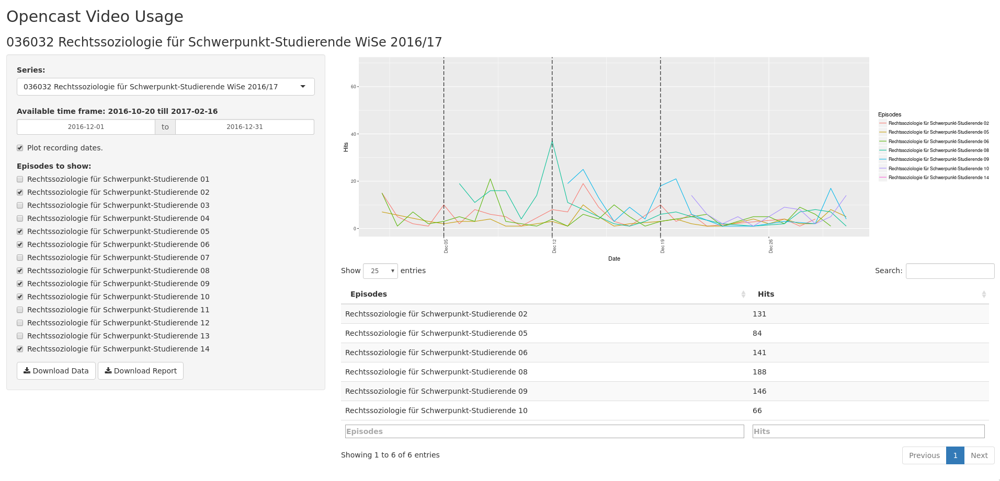

# Opencast Video Usage Analysis

This repo contains a R project for aggregating Opencast usertracking data and visualizing using Shiny. Furthermore it provides a Dockerfile to run the Shiny server.

## R Projekt
This R project is designed to aggregate the usertracking data from an Opencast 2.x server along with the corresponding metadata. To aggregate this data two scripts are provided. The script `initial.R` is designed to initialize the data structures needed. To use it one has to adjust the dates in lines 27 and 28 to specifiy the timeframe that should initially be aggregated. Atfer having initialized the data structures and aggregated the first time frame one can regulary use the script `cron.R` which is designed to aggreagte the data from the last date saved until one day before the system date. In order to be able to use the scripts for aggregating the data one has to specify the following enviroment variables:

* OC_ADMIN_URL - The URL to the Opencast admin server.
* OC_PRESENTATION_URL - The URL to the Opencast presentation server.
* OC_USER - The Opencast digest username.
* OC_PASSWORD - The password for the Opencast digest user.

### Data
The aggregated data is being saved as .csv files in a seperate `data` folder. There are going to be three files:

* `episodes.csv`
* `episodetitles.csv`
* `seriestitles.csv`

The data structure for these files is a follows:

`episodes.csv`

| episodeID           | seriesID                                  | date                 | total                                     |
|---------------------|-------------------------------------------|----------------------|-------------------------------------------|
| UUID of the episode | UUID of the series the episode belongs to | Date it was acsessed | Number of hits on the episode on the date |

`episodetitles.csv`

| ID                  | Title                | Date                          |
|---------------------|----------------------|-------------------------------|
| UUID of the episode | Title of the episode | Recording date of the episode |

`seriestitles.csv`

| ID                 | Title               |
|--------------------|---------------------|
| UUID of the series | Title of the series |

### Shiny
The shiny app is implemented in the files `global.R`, `server.R` and `ui.R`. In RStudio one can just click on *Run App*. When using the provided Dockerimage the shiny interface will be available on port 3838. The selection is being done based on the added query string. This has to contain series=seriesUUID. So an example url using the provided Dockerimage could be host:3838/?series=seriesUUID. Using the shiny web interface one can filter the usage based on series, timeframe and episodes. For the selected series, time frame and episodes a plot is created as well as a table showing the absolut number of hits. This can then be downloaded as raw data or as a short report. The interface looks like this:

